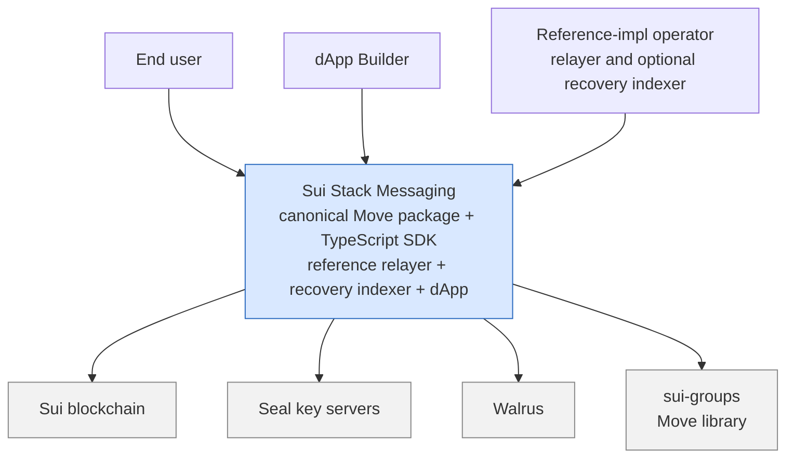
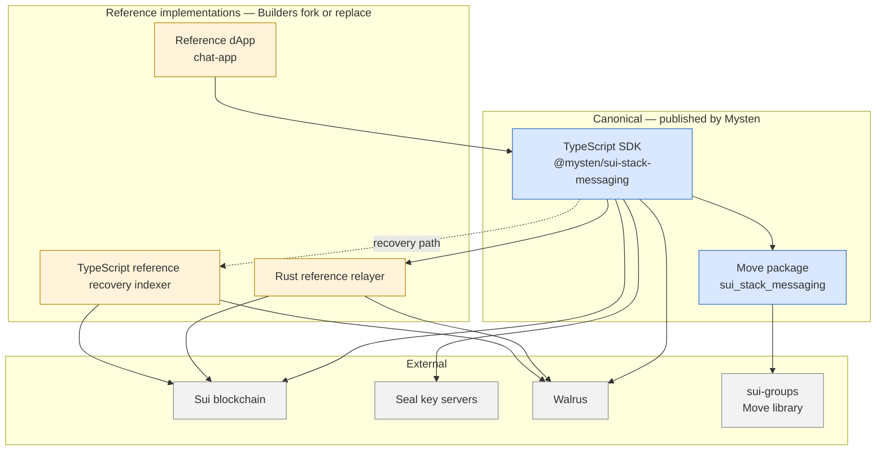
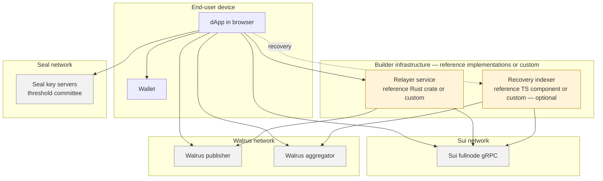

# 00 · Overview

> **Status:** Beta — published on Testnet and Mainnet; production-capable for many use cases. See [`README.md`](../../../README.md).
> **Scope:** the whole `sui-stack-messaging` system — the canonical Move package and TypeScript SDK, plus the reference relayer, reference recovery indexer, and reference dApp that demonstrate one valid realization of the off-chain surface.

The rest of the TDD is split by concern:

| File                                                   | Scope                                                                                              |
| ------------------------------------------------------ | -------------------------------------------------------------------------------------------------- |
| [`01_components.md`](./01_components.md)               | Canonical components — Move package and TypeScript SDK, shown as diagrams + cross-links            |
| [`02_relayer.md`](./02_relayer.md)                     | HTTP relayer interface + Rust reference relayer                                                    |
| [`03_recovery_indexer.md`](./03_recovery_indexer.md)   | `RecoveryTransport` interface + reference TS indexer (Walrus archive recovery)                     |
| [`04_threat_model.md`](./04_threat_model.md)           | STRIDE, trust boundaries, operator-shift posture                                                   |

---

## 1. Context and positioning

`sui-stack-messaging` is **tooling**, not a Mysten-operated product. The repository ships five artifacts with two very different postures:

**Canonical (published and operated by Mysten):**

- **Move package** `sui_stack_messaging` — on-chain protocol: groups, permissions, versioned encryption-key history. Published on testnet and mainnet. IDs pinned in [`move/packages/sui_stack_messaging/Published.toml`](../../../move/packages/sui_stack_messaging/Published.toml).
- **TypeScript SDK** `@mysten/sui-stack-messaging` — client side of the protocol. Contains the authoritative `RelayerTransport`, `StorageAdapter`, `SealPolicy`, and `RecoveryTransport` interfaces.

**Reference implementations:**

- **Rust reference relayer** ([`relayer/`](../../../relayer/)) — one valid realization of the HTTP relayer interface the SDK speaks to.
- **TypeScript reference recovery indexer** ([`walrus-discovery-indexer/`](../../../walrus-discovery-indexer/) — the folder name is legacy) — a reference component that ingests the reference relayer's Walrus archives and exposes them over HTTP, consumable by a Builder-supplied `RecoveryTransport`.
- **Reference dApp `chat-app`** ([`chat-app/`](../../../chat-app/)) — a consumer dApp that exercises the send / fetch / subscribe / attachments / custom-policy surfaces end to end. The opt-in recovery path has its own copy-paste example at [`ts-sdks/packages/sui-stack-messaging/examples/recovery-transport/`](../../../ts-sdks/packages/sui-stack-messaging/examples/recovery-transport/).

The SDK speaks to **a relayer** through the `RelayerTransport` interface and, on the opt-in recovery path, through the `RecoveryTransport` interface; the Rust relayer and TypeScript indexer in this repo are one valid realization of each side.

**Upstream dependency (cross-link only):** the permissioned-groups primitive `sui_groups` lives in its own repository `MystenLabs/sui-groups` with its own TDD at [`sui-groups/docs/TechDesign.md`](https://github.com/MystenLabs/sui-groups/blob/main/docs/TechDesign.md). This TDD treats it as an external primitive and does not re-explain witness scoping, actor-object patterns, or group permissions.

## 2. Scope boundaries

The load-bearing artifacts are four **interfaces**:

| Interface                                                                                                               | Owner                                | Documented in                                                   |
| ----------------------------------------------------------------------------------------------------------------------- | ------------------------------------ | --------------------------------------------------------------- |
| **On-chain Move protocol** — objects, permissions, events, `seal_approve` rules                                         | Mysten canonical                     | [`01_components.md § 1`](./01_components.md)                    |
| **SDK → relayer HTTP interface** — auth scheme, request/response shapes, `sync_status` state machine                    | Mysten canonical, defined by the SDK | [`02_relayer.md § Part A`](./02_relayer.md)                     |
| **SDK extension interfaces** — `RelayerTransport`, `StorageAdapter`, `SealPolicy<TApproveContext>`, `RecoveryTransport` | Mysten canonical                     | [`01_components.md § 2`](./01_components.md), [`03_recovery_indexer.md § Part A`](./03_recovery_indexer.md) for `RecoveryTransport` |

Everything else — Axum handlers, Tokio workers, gRPC checkpoint loops, Express routes, in-memory stores — is reference code, replaceable without touching the protocol.

**Out of scope for this TDD:**

- `sui_groups` internals (linked, not re-explained).
- Seal threshold cryptography primitives (linked to [Seal docs](https://github.com/MystenLabs/seal)).
- Walrus storage internals (linked to Walrus docs).
- End-user UX patterns of the reference dApp — see [`../Examples.md`](../Examples.md).

## 3. System roles and use cases

| Role                                                                         | Primary use cases                                                                                                                                                                                                                               |
| ---------------------------------------------------------------------------- | ----------------------------------------------------------------------------------------------------------------------------------------------------------------------------------------------------------------------------------------------- |
| **dApp Builder**                                                             | Embed encrypted messaging into an app; integrate a custom `SealPolicy` for token-gated chats; supply a custom `StorageAdapter` for non-Walrus attachments; fork the reference relayer or integrate messaging delivery into an existing backend. |
| **Relayer operator** (typically the dApp Builder)                            | Run a relayer that honors the HTTP relayer interface; keep the permission cache in sync with on-chain events; optionally archive to Walrus for durability.                                                                                      |
| **Indexer operator** (optional — only if the app wires up the recovery path) | Run an indexer that produces patch listings a Builder's `RecoveryTransport` can consume — the reference indexer ingests Walrus `BlobCertified` events from Sui and quilt tags from Walrus, but any backing store is valid.                         |
| **End user** (via a Builder dApp)                                            | Create or join groups; send, edit, delete end-to-end encrypted messages; attach files; recover message history after device loss.                                                                                                               |

The reference dApp `chat-app` demonstrates all of the above against a Builder-operated relayer and the testnet Move package.

---

## 4. System context — C4 Level 1

The operator role covers whoever actually runs a relayer and optionally a recovery indexer — typically the Builder themselves, but sometimes a third party the Builder delegates to.

## 5. Containers and end-to-end runtime topology — C4 Level 2

### 5.1 Containers

**Edge legend.** Solid edges are load-bearing at runtime for the send/receive path. The dashed edge to the recovery indexer is engaged only when a consumer wires up `RecoveryTransport` (archive replay after device loss, or when the relayer cannot serve history).

### 5.2 End-to-end runtime topology

Where the containers above actually run at call time. The picture varies with the Builder's posture toward off-chain infrastructure. The reference setup is a single Builder who runs a relayer and a recovery indexer; another common posture is a Builder who folds relayer duties into an existing backend and skips the indexer entirely.

**Reference-impl labels.** The only nodes labelled "reference" are `bRelayer` and `bIndexer`, and both are explicitly marked "reference … or custom". No nodes sit inside a "Mysten-operated" boundary — Mysten does not operate relayers or indexers for Builder traffic.

---

## 6. Architectural Decision Records

Six load-bearing decisions. Rationale lives in the per-component files; this section is the index of _why_ the system looks the way it does.

### ADR-1 — Reference implementations, canonical interfaces

**Decision:** Mysten ships and maintains the Move package and TypeScript SDK as canonical. The Rust relayer, TypeScript recovery indexer, and dApp are reference implementations Builders fork, extend, or replace.

**Rationale:** keeps Mysten off the operational hook for Builder traffic while standardizing the interfaces every Builder implementation must honor. Just as importantly, Builders can implement their own relayer and indexer backends against their own scaling needs and existing architecture.

**Consequences:** the TDD leads with interfaces (in [`02_relayer.md § Part A`](./02_relayer.md) and [`03_recovery_indexer.md § Part A`](./03_recovery_indexer.md)); Rust and TS reference code is presented as one realization per file's Part B.

### ADR-2 — Versioned encryption-key history as on-chain `TableVec`

**Decision:** all historical encrypted DEKs live in `EncryptionHistory.encrypted_keys: TableVec<vector<u8>>` indexed by version. The 40-byte identity in `seal_approve` is `[group_id (32 B)][key_version (8 B LE u64)]`, so the `key_version` suffix is the direct `TableVec` index for the corresponding DEK.

**Rationale:** deterministic decryption of historical messages without off-chain aggregation; archive recovery stays cheap; key rotation is an append, not a migration.

**Consequences:** storage grows linearly in rotation count, and DEKs are hard-capped at 1024 Bytes. Elaborated in [`01_components.md § 3`](./01_components.md) and [`../Encryption.md`](../Encryption.md).

### ADR-3 — Actor-object pattern for self-service operations

**Decision:** singleton actor objects (`GroupLeaver`, `GroupManager`) hold admin-level permissions on every group; generic functions in those modules are instantiated at call sites so members can exercise self-service operations (leave, set-name, SuiNS updates) without holding admin permissions themselves.

**Rationale:** scopes admin authority to a trusted module rather than scattering it across every member wallet, and keeps the actor's `&UID` module-private so only the module that defined it can authorize the call.

**Consequences:** extensions follow the same pattern — see [`move/packages/example_app/paid_join_rule.move`](../../../move/packages/example_app/sources/paid_join_rule.move). Elaborated in [`01_components.md § 3.5`](./01_components.md).

### ADR-4 — Envelope encryption with standard identity bytes

**Decision:** messages are encrypted with a group DEK using AES-256-GCM + 12-byte nonce + AAD `[group_id][key_version][sender_address]`. The DEK itself is Seal-encrypted with the standard identity `[group_id][key_version]` — the same format every Builder's custom Seal policy must use.

**Rationale:** amortizes expensive Seal-threshold operations across many messages; AAD binds ciphertext to its group / version / sender so misattribution or cross-context replay fails fast; a shared identity format prevents per-policy encoding fragmentation and lets `seal_policies::validate_identity` centralize the check.

**Consequences:** key rotation is the post-compromise mitigation, not per-message ratcheting — see [`../Security.md`](../Security.md) and [`04_threat_model.md § forward secrecy`](./04_threat_model.md). Custom seal policies inherit the identity format automatically. Elaborated in [`01_components.md § 2`](./01_components.md) and [`../Encryption.md`](../Encryption.md).

### ADR-5 — Transport, storage, and recovery as SDK interfaces

**Decision:** the SDK ships `RelayerTransport`, `StorageAdapter`, and `RecoveryTransport` as the canonical interfaces. The shipped HTTP relayer transport and Walrus storage adapter are reference implementations; `RecoveryTransport` is interface-only (the SDK ships no default) — Builders construct one that talks to whatever archive source they run. Any impl that honors an interface is a valid substitute.

**Rationale:** Builders replace off-chain infrastructure without forking the SDK; the interface is the boundary, and drift between any reference impl and its interface is a bug in the impl — never in the interface. Keeping `RecoveryTransport` interface-only makes it explicit that the SDK does not mandate HTTP, an indexer, or any particular Walrus tag schema.

**Consequences:** [`02_relayer.md`](./02_relayer.md) and [`03_recovery_indexer.md`](./03_recovery_indexer.md) are split Part A (interface) / Part B (reference impl) accordingly. For recovery the "reference impl" is the reference relayer + reference indexer pair plus an optional `fromWalrusMessage` payload helper — none of it required by the interface. Custom transports are documented in [`../Extending.md`](../Extending.md) and [`../ArchiveRecovery.md`](../ArchiveRecovery.md).

### ADR-6 — Pluggable `SealPolicy<TApproveContext>`

**Decision:** the SDK's `SealPolicy<TApproveContext>` interface lets consumers supply a custom `seal_approve` transaction builder with an optional extra context type. Identity bytes remain canonical per ADR-4; only the approval check varies.

**Rationale:** access control is the most common extension point for messaging — subscription gates, NFT-gates, payment rules, time-boxed invitations. Centralizing on a typed context argument while fixing the identity format keeps custom policies interoperable with the DEK format.

**Consequences:** when `TApproveContext` is `void`, public SDK methods drop the context argument; custom policies match the `TApproveContext` they declare. The example consumer in [`move/packages/example_app/`](../../../move/packages/example_app/) demonstrates a subscription-gated policy. Elaborated in [`01_components.md § 3.8`](./01_components.md).

---

## 7. Where to go next

- Start with [`01_components.md`](./01_components.md) for the canonical Move package and SDK — objects, extension interfaces, and end-to-end sequence diagrams.
- [`02_relayer.md`](./02_relayer.md) and [`03_recovery_indexer.md`](./03_recovery_indexer.md) for the off-chain interfaces and their reference implementations.
- [`04_threat_model.md`](./04_threat_model.md) for STRIDE, trust boundaries, and how the security posture shifts when Builders run their own infrastructure.
- User-facing narrative docs stay where they are: [`../Installation.md`](../Installation.md), [`../Setup.md`](../Setup.md), [`../APIRef.md`](../APIRef.md), [`../Encryption.md`](../Encryption.md), [`../Security.md`](../Security.md), [`../Relayer.md`](../Relayer.md), [`../Attachments.md`](../Attachments.md), [`../ArchiveRecovery.md`](../ArchiveRecovery.md), [`../GroupDiscovery.md`](../GroupDiscovery.md), [`../Extending.md`](../Extending.md), [`../Testing.md`](../Testing.md), [`../CommunityContributed.md`](../CommunityContributed.md).
