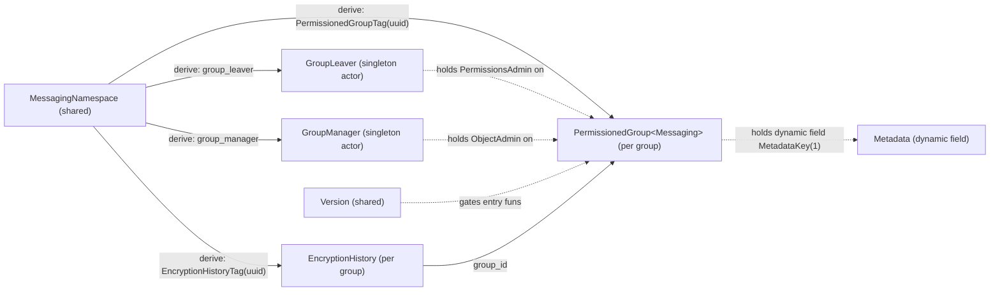
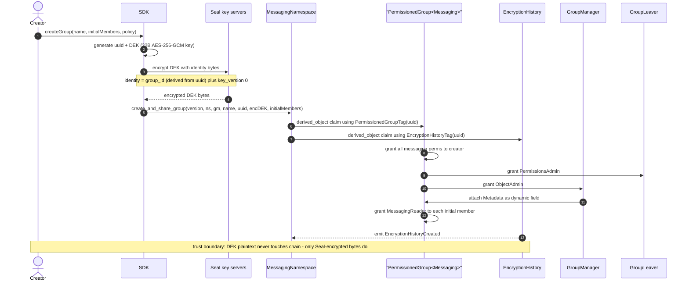
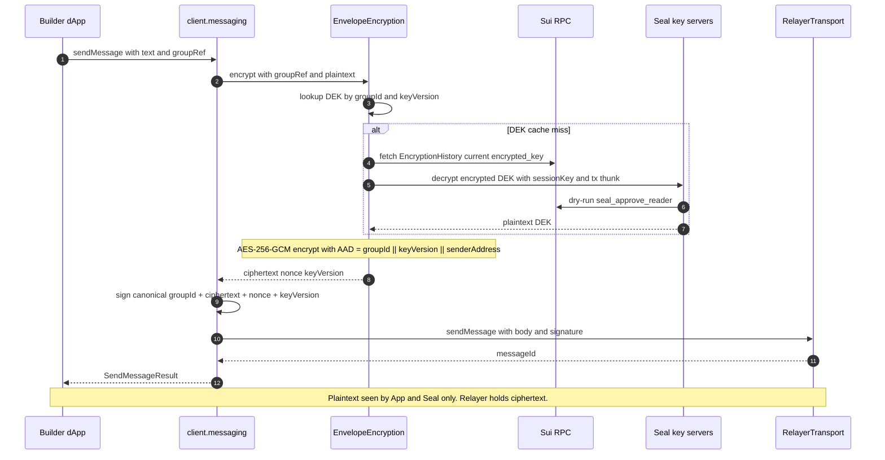
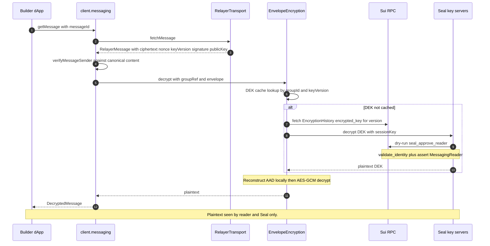
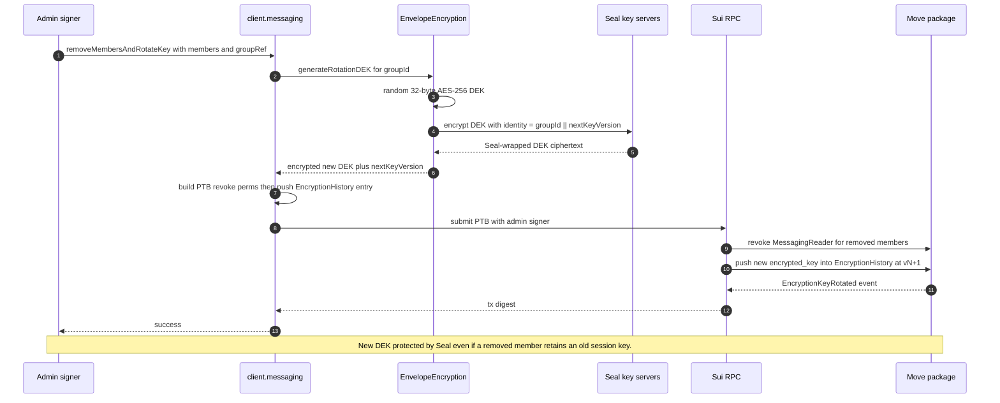
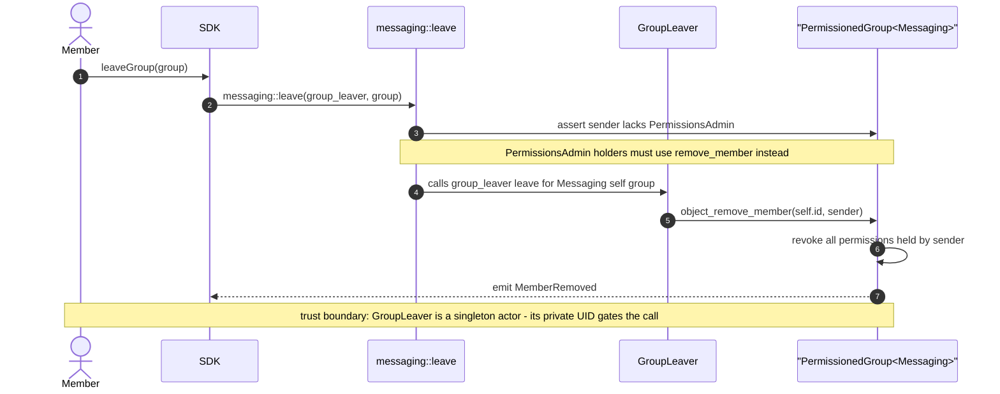
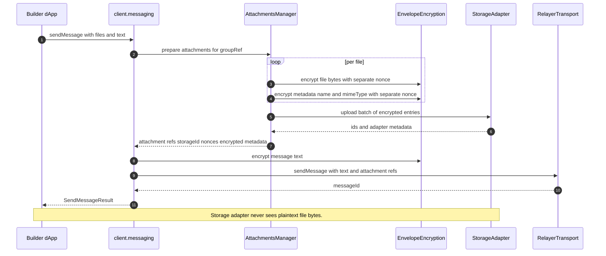
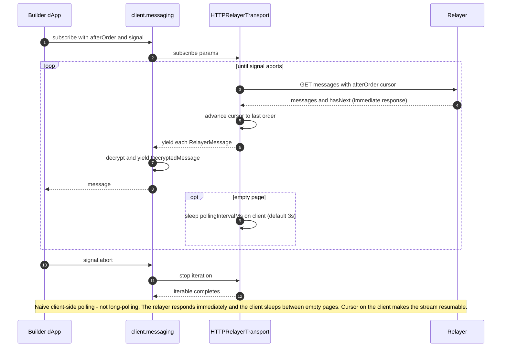
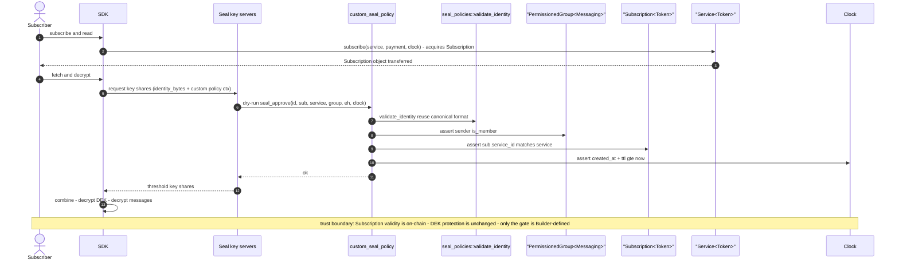

# 01 — Components (Move package + TypeScript SDK)

The canonical half of `sui-stack-messaging` — the on-chain Move package and the TypeScript SDK — shown together as diagrams and cross-links. Everything off-chain is one realization of an interface, covered in [`02_relayer.md`](./02_relayer.md) and [`03_recovery_indexer.md`](./03_recovery_indexer.md).

This file's role is architectural orientation: where the modules live, what objects they expose, and what the end-to-end flows look like when the on-chain and client layers act together.

**Cross-links for deeper reading:**

- On-chain protocol narrative, permissions, encryption history, SuiNS, metadata → per-module design docs in [`move/design_docs/sui_stack_messaging/`](../../../move/design_docs/sui_stack_messaging/) and the high-level [`move/design_docs/REQUIREMENTS.md`](../../../move/design_docs/REQUIREMENTS.md).
- Generic permissioned-group primitive, witness scoping, actor-object pattern → [sui-groups TDD](https://github.com/MystenLabs/sui-groups/blob/main/docs/TechDesign.md).
- SDK API reference (full method signatures and types) → [`../APIRef.md`](../APIRef.md).
- Installation, setup, client composition → [`../Installation.md`](../Installation.md), [`../Setup.md`](../Setup.md).
- Encryption rationale, envelope encryption, AAD, session keys, key versioning → [`../Encryption.md`](../Encryption.md).
- Custom Seal policies, custom transports, custom storage → [`../Extending.md`](../Extending.md).
- Attachment lifecycle → [`../Attachments.md`](../Attachments.md).
- Archive recovery → [`../ArchiveRecovery.md`](../ArchiveRecovery.md).
- Threat model and trust boundaries → [`04_threat_model.md`](./04_threat_model.md), [`../Security.md`](../Security.md).

ADRs that govern this layer — versioned key history (ADR-2), actor-object self-service (ADR-3), envelope encryption with standard identity bytes (ADR-4), pluggable `SealPolicy` (ADR-6) — live in [`00_overview.md`](./00_overview.md).

---

## 1. Move package — module and object map

| Module                                    | Role                                                                                                                             |
| ----------------------------------------- | -------------------------------------------------------------------------------------------------------------------------------- |
| `sui_stack_messaging::messaging`          | Public-facing module. Wraps `PermissionedGroup<Messaging>`, defines messaging permissions, owns group lifecycle entrypoints.     |
| `sui_stack_messaging::encryption_history` | Versioned per-group store of Seal-encrypted DEKs. Derived 1:1 from each group via UUID.                                          |
| `sui_stack_messaging::seal_policies`      | Default `seal_approve_reader` and the canonical `validate_identity` helper all custom Seal policies reuse.                       |
| `sui_stack_messaging::group_leaver`       | Singleton actor object holding `PermissionsAdmin` on every group. Powers self-service `leave()`.                                 |
| `sui_stack_messaging::group_manager`      | Singleton actor object holding `ObjectAdmin` on every group. Mediates SuiNS reverse lookups and `Metadata` dynamic-field access. |
| `sui_stack_messaging::metadata`           | Schema-versioned `Metadata` struct attached to each group as a dynamic field.                                                    |
| `sui_stack_messaging::version`            | Shared `Version` object gating entry functions for forward-compatible upgrades.                                                  |

Depends on `sui_groups` for `PermissionedGroup<T>`, `PermissionsAdmin`, `ObjectAdmin`, and the underlying actor-object pattern.

### Object relationship



Published package IDs (mainnet and testnet), upgrade-cap addresses, and Move.lock digests are pinned in [`move/packages/sui_stack_messaging/Published.toml`](../../../move/packages/sui_stack_messaging/Published.toml). Localnet and custom-network deployments require an explicit `packageConfig` in the SDK — see [`../Setup.md`](../Setup.md).

The protocol emits `EncryptionHistoryCreated` and `EncryptionKeyRotated` from `encryption_history`; membership and permission events (`MemberAdded`, `MemberRemoved`, `PermissionsGranted`, `PermissionsRevoked`, `GroupDerived<Messaging, _>`, etc.) are inherited from `sui_groups::permissioned_group`. The reference relayer emits Walrus `BlobCertified` events as a side effect of archival — see [`03_recovery_indexer.md`](./03_recovery_indexer.md) Part B.1.

---

## 2. TypeScript SDK — module map and extension interfaces

Package: `@mysten/sui-stack-messaging` (ESM-only, NodeNext module resolution). Published by Mysten. Full install / setup in [`../Installation.md`](../Installation.md) and [`../Setup.md`](../Setup.md).

```
ts-sdks/packages/sui-stack-messaging/src/
  client.ts             SuiStackMessagingClient + suiStackMessaging() extension factory
  factory.ts            createSuiStackMessagingClient convenience wrapper
  encryption/           session keys, DEK manager, envelope, Seal policy, primitives
  relayer/              RelayerTransport interface + HTTP reference impl
  storage/              StorageAdapter interface + Walrus HTTP reference impl
  attachments/          AttachmentsManager wiring encryption + storage
  recovery/             RecoveryTransport interface + walrus-message helpers
  contracts/            auto-generated Move bindings (regenerate via pnpm codegen)
  call.ts               transaction-builder thunks (no signer)
  transactions.ts       wrappers that take a signer
  view.ts               read-only RPC queries
  derive.ts             deterministic ID derivation
  verification.ts       buildCanonicalMessage, verifyMessageSender
```

The SDK is the single boundary a Builder dApp integrates against. It plugs into the base Sui client via `$extend()` — alongside `@mysten/sui-groups` and `@mysten/seal` — and exposes high-level messaging methods under `client.messaging`.

**Four canonical extension interfaces.** Every off-chain component is plugged in through one of these. The interface is the boundary — any implementation that honors it is a valid substitute (ADR-5):

| Interface                     | Purpose                                                                                  | Reference impl                                                                                          |
| ----------------------------- | ---------------------------------------------------------------------------------------- | ------------------------------------------------------------------------------------------------------- |
| `RelayerTransport`            | Send / fetch / update / delete messages; subscribe to real-time delivery.                | `HTTPRelayerTransport` speaks the HTTP interface in [`02_relayer.md`](./02_relayer.md).                 |
| `StorageAdapter`              | Upload and download opaque ciphertext bytes for attachments.                             | `WalrusHttpStorageAdapter` speaks the Walrus publisher quilt API.                                       |
| `RecoveryTransport`           | Archive replay — yield archived messages in order for a given group reference.           | Interface-only in the SDK. The reference indexer + reference relayer pair documented in [`03_recovery_indexer.md`](./03_recovery_indexer.md) is one consumable archive source. |
| `SealPolicy<TApproveContext>` | Build the `seal_approve` PTB that Seal key servers dry-run before releasing a key share. | `DefaultSealPolicy` targets `seal_policies::seal_approve_reader`.                                       |

Builders supply custom implementations via the SDK options. For walkthroughs see [`../Extending.md`](../Extending.md).

**Encryption orchestration.** The SDK implements envelope encryption: a per-group, per-version 32-byte AES-256 DEK encrypts payloads; Seal threshold-encrypts the DEK. The standard 40-byte identity `[group_id (32 B)][key_version (8 B LE u64)]` binds every DEK to its group and version. AAD `[group_id][key_version][sender_address]` binds every ciphertext to its context. See [`../Encryption.md`](../Encryption.md) for the full rationale.

**Verification.** Every `sendMessage` / `updateMessage` carries a per-message signature over the canonical content (`verifyMessageSender` in [`src/verification.ts`](../../../ts-sdks/packages/sui-stack-messaging/src/verification.ts)). AAD prevents cross-context replay; the per-message signature establishes authorship independently of the transport.

**Move bindings** under `src/contracts/sui_stack_messaging/` are auto-generated by `@mysten/codegen` via `pnpm codegen`. Do not hand-edit.

---

## 3. End-to-end sequence diagrams

The flows below cross the on-chain / client boundary. Each diagram carries an explicit trust-boundary note; for the full STRIDE table see [`04_threat_model.md`](./04_threat_model.md).

### 3.1 Group creation with encryption



### 3.2 Send message end-to-end



### 3.3 Fetch and decrypt



### 3.4 Remove member and rotate key (atomic)



### 3.5 Member self-service leave



### 3.6 Attachment upload and reference



### 3.7 Subscribe — client-side polling lifecycle



### 3.8 Custom Seal policy (subscription-gated extensibility)

Demonstrated by [`move/packages/example_app/sources/custom_seal_policy.move`](../../../move/packages/example_app/sources/custom_seal_policy.move) and its paired [`paid_join_rule.move`](../../../move/packages/example_app/sources/paid_join_rule.move). The canonical identity format is unchanged — only the approval check varies. For the user guide, see [`../Extending.md`](../Extending.md).



---

## 4. Where to go next

- Off-chain interfaces and reference implementations → [`02_relayer.md`](./02_relayer.md) and [`03_recovery_indexer.md`](./03_recovery_indexer.md).
- Full STRIDE table, trust boundaries, and operator-shift posture → [`04_threat_model.md`](./04_threat_model.md).
- Per-module Move design notes → [`move/design_docs/sui_stack_messaging/`](../../../move/design_docs/sui_stack_messaging/).
- SDK API reference, narrative encryption / attachments / recovery guides → [`../APIRef.md`](../APIRef.md), [`../Encryption.md`](../Encryption.md), [`../Attachments.md`](../Attachments.md), [`../ArchiveRecovery.md`](../ArchiveRecovery.md).
- Custom Seal policies, custom transports, custom storage → [`../Extending.md`](../Extending.md).
- Generic permissioned-group primitive → [sui-groups TDD](https://github.com/MystenLabs/sui-groups/blob/main/docs/TechDesign.md).
