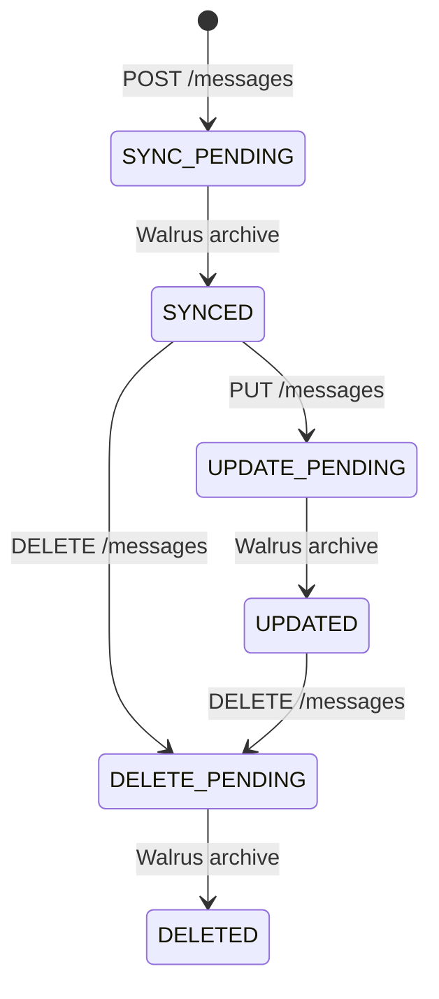
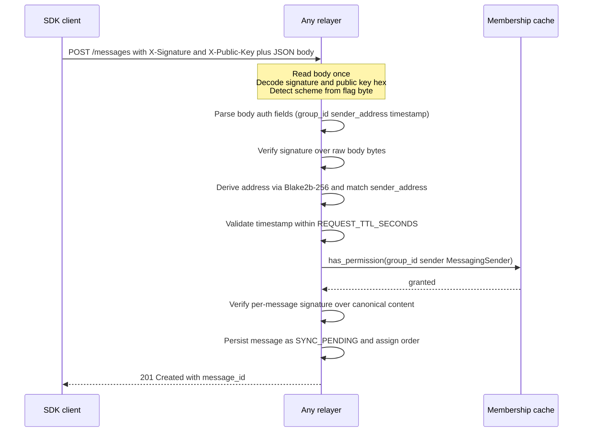
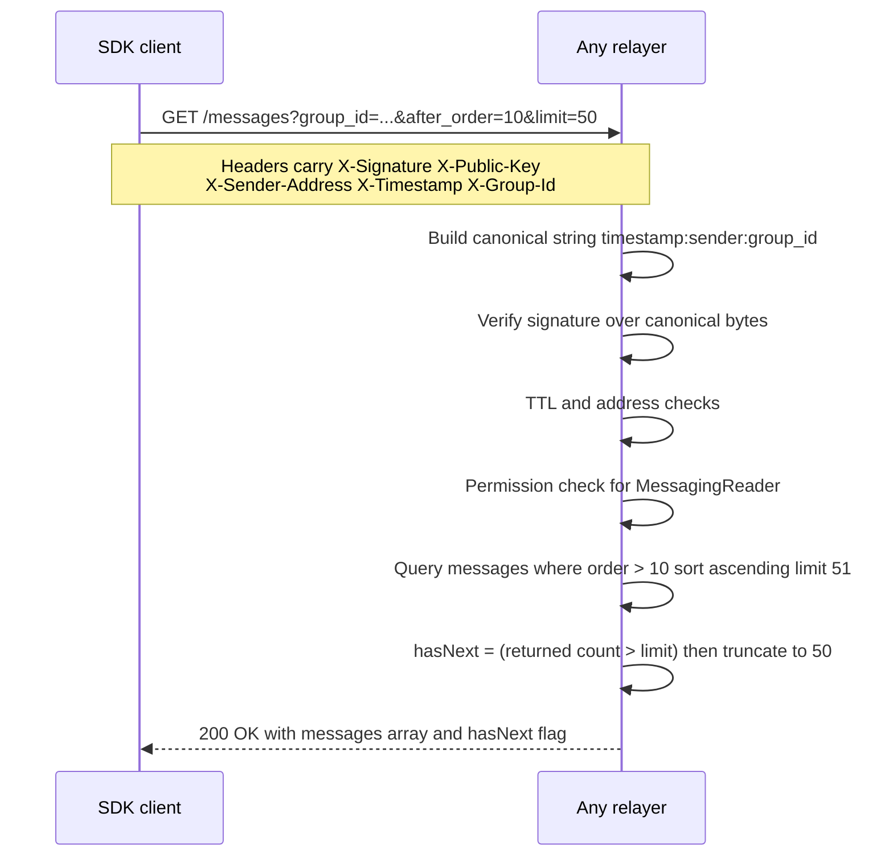
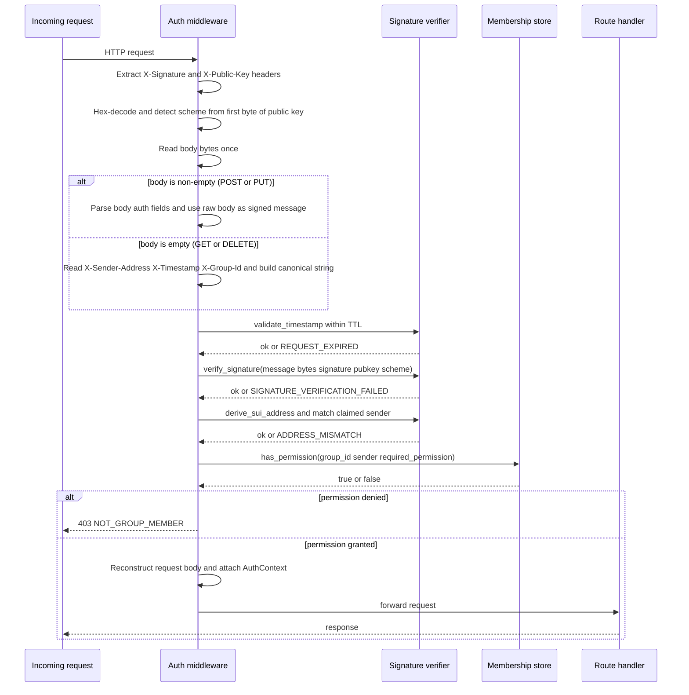
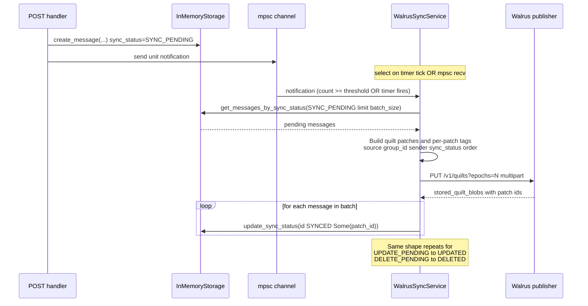
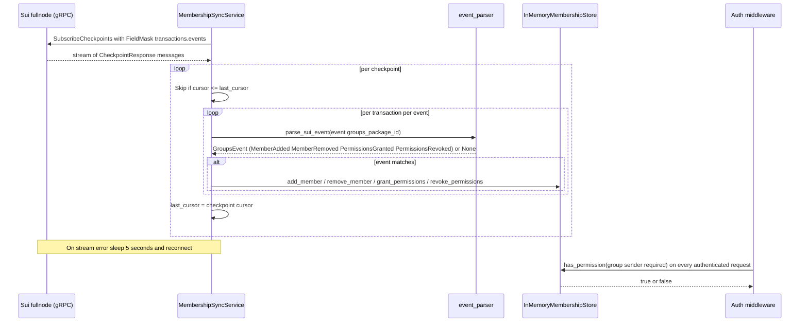

# 02 — Relayer

`sui-stack-messaging` separates two layers along the same seam:

1. **A canonical interface.** The SDK binds to the TypeScript `RelayerTransport` interface ([`ts-sdks/packages/sui-stack-messaging/src/relayer/transport.ts`](../../../ts-sdks/packages/sui-stack-messaging/src/relayer/transport.ts)) — a **protocol-agnostic** set of methods plus the typed `RelayerMessage` shape and cross-transport semantics (pagination, `sync_status` state machine). Any backend reachable through an implementation of this interface — HTTP, gRPC, WebSocket, in-process — is a valid relayer.
2. **A reference HTTP wire format and Rust implementation.** The SDK ships a default `HTTPRelayerTransport`, and the Rust crate at [`relayer/`](../../../relayer/) is the paired server realization. Together they define the HTTP routes, recommended auth scheme, and JSON shapes that any HTTP-based relayer targeting the default SDK transport must honor. Non-HTTP transports bypass this entirely.

This file is in two parts. **Part A** documents the canonical interface and, as a reference, the HTTP wire format the default transport speaks. **Part B** documents the Rust server realization in [`relayer/src/`](../../../relayer/src/) as choices rather than requirements.

For the high-level "why a relayer at all" framing see [`../Relayer.md`](../Relayer.md). For the long-term archival lifecycle see [`../ArchiveRecovery.md`](../ArchiveRecovery.md). For the SDK side of the transport interface (`RelayerTransport`) see [`./01_components.md § 2`](./01_components.md). The reference-impl framing is captured as ADR-1 and the wire-interface-first framing as ADR-5 in [`./00_overview.md`](./00_overview.md).

---

## Part A — Canonical interface and reference HTTP wire format

### A.0 Canonical `RelayerTransport` interface (protocol-agnostic)

The SDK binds only to this TypeScript surface:

```ts
interface RelayerTransport {
  sendMessage(params: SendMessageParams): Promise<SendMessageResult>;
  fetchMessages(params: FetchMessagesParams): Promise<FetchMessagesResult>;
  fetchMessage(params: FetchMessageParams): Promise<RelayerMessage>;
  updateMessage(params: UpdateMessageParams): Promise<void>;
  deleteMessage(params: DeleteMessageParams): Promise<void>;
  subscribe(params: SubscribeParams): AsyncIterable<RelayerMessage>;
  disconnect(): void;
}
```

Together with the typed `RelayerMessage` shape, the pagination semantics in A.4, and the `sync_status` state machine in A.5, these methods are the load-bearing contract. A gRPC, WebSocket, or in-process implementation is a conforming relayer the moment it honors this surface; it ignores A.1–A.3 and A.6 below.

The remaining sections (A.1–A.3, A.6) document the **reference HTTP wire format** used by the SDK's default `HTTPRelayerTransport` and implemented by the reference Rust relayer. An HTTP-based relayer targeting the default transport must match these; other transports do not.

### A.1 Routes (HTTP reference)

| Method   | Path                    | Required permission   | Body | Auth shape |
|----------|-------------------------|-----------------------|------|------------|
| `GET`    | `/health_check`         | none                  | none | none |
| `POST`   | `/messages`             | `MessagingSender`     | JSON | body auth |
| `GET`    | `/messages`             | `MessagingReader`     | none | header auth |
| `PUT`    | `/messages`             | `MessagingEditor`     | JSON | body auth |
| `DELETE` | `/messages/:message_id` | `MessagingDeleter`    | none | header auth |

Permissions are the four `MessagingPermission` variants the upstream `sui-groups` package grants per member. Any relayer must reject a request whose authenticated sender lacks the variant matching the HTTP method.

### A.2 Authentication scheme (HTTP reference — recommended, not required of `RelayerTransport`)

All authenticated requests carry two headers:

- `X-Signature` — hex-encoded **64-byte raw signature** (no flag prefix).
- `X-Public-Key` — hex-encoded **`flag_byte || pubkey`**, where `flag_byte` selects the scheme: `0x00` Ed25519 (32 B key), `0x01` Secp256k1 (33 B compressed), `0x02` Secp256r1 (33 B compressed).

The remaining auth fields (`group_id`, `sender_address`, `timestamp`) live in two different places depending on whether the request has a body:

- **POST / PUT (`body auth`).** The fields are top-level keys in the JSON body. The signed message is **the entire raw request body bytes** as transmitted on the wire — no canonicalization, no re-serialization. A conforming relayer reads the body once, parses the auth fields, and verifies the signature against the same byte slice.
- **GET / DELETE (`header auth`).** The fields come from headers `X-Sender-Address`, `X-Timestamp` (Unix seconds), and `X-Group-Id`. The signed message is the canonical string `"{timestamp}:{sender_address}:{group_id}"` UTF-8 encoded.

Verification uses the standard Sui personal-message wrapper: signers MUST sign via the same `PersonalMessage` framing the Sui wallets and `sui-crypto::SuiSigner` use, and verifiers MUST verify the same way. Address derivation is `Blake2b-256(flag_byte || pubkey)`, hex-prefixed with `0x`. The request is rejected when the derived address differs from the claimed `sender_address`.

**Replay protection.** Timestamps must satisfy `|now - timestamp| <= REQUEST_TTL_SECONDS`. The default window in the reference implementation is **900 seconds (15 minutes)**; Builders running their own relayer choose their own window. (Note: `Relayer.md` previously documented 300 s; the source default is 900 s — the user docs are the stale ones.)

**Per-message signature.** POST and PUT additionally carry a `message_signature` field inside the body that signs the canonical string `"{group_id}:{encrypted_text}:{nonce}:{key_version}"`. This signature is stored alongside the message and returned to readers so receivers can independently verify sender authorship without trusting the transport layer. The header signature authenticates the *transport*; the per-message signature authenticates the *content*.

### A.3 Request and response shapes (HTTP reference)

**`POST /messages` request body:**

```json
{
  "group_id": "0x...",
  "encrypted_text": "<hex>",
  "nonce": "<hex 12B>",
  "key_version": 0,
  "sender_address": "0x...",
  "timestamp": 1730000000,
  "message_signature": "<hex 64B>",
  "attachments": [
    {
      "storage_id": "...",
      "nonce": "<hex 12B>",
      "encrypted_metadata": "<hex>",
      "metadata_nonce": "<hex 12B>"
    }
  ]
}
```

**`POST /messages` response (`201 Created`):**

```json
{ "message_id": "<uuid>" }
```

**`GET /messages` query parameters:** `message_id?`, `group_id?` (required if `message_id` absent), `after_order?`, `before_order?`, `limit?` (default `50`, capped at `100`).

**`GET /messages` single-message response** (when `message_id` is provided) and **list response** share the same `MessageResponse` shape:

```json
{
  "message_id": "<uuid>",
  "group_id": "0x...",
  "order": 0,
  "encrypted_text": "<hex>",
  "nonce": "<hex>",
  "key_version": 0,
  "sender_address": "0x...",
  "created_at": 0,
  "updated_at": 0,
  "attachments": [ /* same shape as POST */ ],
  "is_edited": false,
  "is_deleted": false,
  "sync_status": "SYNC_PENDING",
  "quilt_patch_id": null,
  "signature": "<hex 64B>",
  "public_key": "<hex flag_byte||key>"
}
```

The list variant wraps it: `{ "messages": [MessageResponse, ...], "hasNext": false }`.

**Error response (4xx / 5xx):**

```json
{ "error": "human-readable reason", "code": "OPTIONAL_MACHINE_CODE" }
```

The interface reserves the following machine codes for auth failures so SDK clients can branch on them: `MISSING_SIGNATURE`, `MISSING_PUBLIC_KEY`, `MISSING_TIMESTAMP`, `MISSING_SENDER_ADDRESS`, `MISSING_GROUP_ID`, `INVALID_SIGNATURE_FORMAT`, `INVALID_PUBLIC_KEY_FORMAT`, `INVALID_TIMESTAMP`, `SIGNATURE_VERIFICATION_FAILED`, `ADDRESS_MISMATCH`, `REQUEST_EXPIRED`, `NOT_GROUP_MEMBER`. Handler-level errors use `BAD_REQUEST`, `NOT_FOUND`, `FORBIDDEN`, etc.

### A.4 Pagination semantics (canonical)

- `after_order` and `before_order` are **exclusive bounds**: results satisfy `after_order < order < before_order`.
- Results are sorted by `order` ascending.
- `limit` defaults to 50 and is hard-capped at 100. A relayer that accepts a larger value is non-conforming.
- `hasNext` reflects whether more results exist past the returned page. The interface does not mandate the implementation strategy; the reference relayer uses the standard "fetch `limit + 1`, trim, and inspect" overfetch trick.
- Each `(group_id, order)` pair must be unique and monotonically increasing — `order` is the per-group sequence a conforming relayer assigns at create time.

### A.5 `sync_status` state machine (canonical — applies when the relayer archives)

Every message exposes a `sync_status` field naming its position in the relayer-to-Walrus archival lifecycle. Six states, three legal transition pairs:



The `*_PENDING` states are owned by the request-handling path (handlers transition into them). The terminal `SYNCED` / `UPDATED` / `DELETED` states are owned by the archival path. The interface requires only that:

1. A new message is observable as `SYNC_PENDING` immediately after a `201` response.
2. `quilt_patch_id` becomes non-null no later than the `SYNCED` / `UPDATED` transition.
3. `is_deleted` is `true` whenever `sync_status` is `DELETE_PENDING` or `DELETED`.

The cadence and batching of the pending-to-terminal transitions are an implementation choice (see B.5).

### A.6 Wire-flow diagrams (HTTP reference)

**POST /messages — body-auth flow.**



**GET /messages — header-auth pagination flow.**



**Auth verification middleware sequence.**



---

## Part B — Reference Rust implementation

The crate at [`relayer/`](../../../relayer/) realizes Part A as a single Rust binary. This section documents the choices it makes; Builders running their own service can keep, replace, or rewrite any of them as long as the wire interface from Part A is preserved.

### B.1 Binary and framework choices

A single binary `messaging-relayer` is built from `relayer/Cargo.toml`. Top-level dependency choices ([`Cargo.toml`](../../../relayer/Cargo.toml) lines 14–45):

- **Axum 0.7** for HTTP — type-safe extractors, middleware as plain async functions, native `tower` interop.
- **Tokio 1.43** with the `full` feature for the async runtime.
- **serde + serde_json** with `preserve_order` so JSON field ordering is stable.
- **tracing + tracing-subscriber** for structured logs.
- **sui-crypto + sui-sdk-types + blake2** for Ed25519 / Secp256k1 / Secp256r1 verification and Sui address derivation.
- **sui-rpc 0.2 + bcs + tokio-stream** for the Sui gRPC checkpoint subscription consumed by the membership sync service.
- **reqwest 0.12** with `multipart` and `json` features for the Walrus HTTP client.
- **tower-http 0.6** for the permissive demo CORS layer (production deployments should restrict the origin allowlist).

Startup wires three concurrent tasks: the Axum HTTP server, a `MembershipSyncService`, and a `WalrusSyncService`. See [`relayer/src/main.rs`](../../../relayer/src/main.rs) lines 34–120.

### B.2 Auth pipeline

The auth pipeline lives in [`relayer/src/auth/middleware.rs`](../../../relayer/src/auth/middleware.rs). It runs before every authenticated route in this order:

1. Map HTTP method to `MessagingPermission` (line 79).
2. Extract `X-Signature` header (line 91), error `MISSING_SIGNATURE` if absent.
3. Extract `X-Public-Key` (line 103), hex-decode (line 115), detect scheme from the first byte (line 133), validate length per scheme (line 151).
4. Hex-decode the signature bytes (line 164).
5. Buffer the request body once (line 175); the same bytes feed both signature verification and the downstream handler.
6. Extract auth fields: from the parsed JSON body for POST / PUT (lines 191–209), from headers for GET / DELETE (lines 212–256).
7. Validate the timestamp via `validate_timestamp` against `config.request_ttl_seconds` (line 260).
8. Verify the signature via `verify_signature` using the scheme-aware `UserSignatureVerifier` (line 265).
9. Derive the Sui address and match it against the claimed `sender_address` (line 271).
10. Check `MembershipStore::has_permission` (line 276); on miss return `403 NOT_GROUP_MEMBER`.
11. Attach an `AuthContext` to the request extensions (line 298) and forward to the handler.

The auth pipeline never trusts a header more than once — `sender_address` is always cross-checked against the public key, and the public key is always cross-checked against the signed bytes.

### B.3 Handlers

Handlers live in [`relayer/src/handlers/messages/handlers.rs`](../../../relayer/src/handlers/messages/handlers.rs). One line each:

- `health_check` — stateless `200 OK`, no auth.
- `create_message` (line 30) — verifies the per-message signature, decodes hex fields, persists as `SYNC_PENDING`, notifies the Walrus worker.
- `get_messages` (line 93) — returns a single message by id or a paginated list by group; double-checks that `auth.authorized_group` matches the requested group.
- `update_message` (line 146) — re-verifies group membership and the per-message signature, then re-checks that `sender_address` matches the original message's sender (only the original author can edit).
- `delete_message` (line 216) — same ownership check, then soft-deletes via `mark_for_deletion`, transitioning to `DELETE_PENDING`.

### B.4 Storage

The `StorageAdapter` async trait in [`relayer/src/storage/adapter.rs`](../../../relayer/src/storage/adapter.rs) defines the full message-CRUD surface. The reference crate ships exactly **one** implementation: `InMemoryStorage` in [`relayer/src/storage/memory.rs`](../../../relayer/src/storage/memory.rs).

- Backed by three `RwLock`-protected `HashMap` / `HashSet` structures: messages by id, per-group order counter, nonce dedup set.
- Per-group `order` is assigned at create time as a monotonically increasing counter.
- O(1) nonce duplicate rejection on POST and PUT.
- Lock ordering: always `messages` before `nonces` to prevent deadlocks (see file header note).
- All state is lost on process restart — durability is delegated to Walrus via the sync worker (B.5).

The trait surface anticipates additional backends but no others ship today. `STORAGE_TYPE=postgres` is parsed but resolves to `InMemory` in [`relayer/src/config.rs`](../../../relayer/src/config.rs) lines 84–92. Treat the trait as the interface a future backend would have to honor; treat the in-memory adapter as the only one in production today.

### B.5 Walrus sync worker

The worker is `WalrusSyncService` in [`relayer/src/services/walrus_sync.rs`](../../../relayer/src/services/walrus_sync.rs), spawned at startup. It owns the `*_PENDING` to terminal transitions for the `sync_status` state machine in A.5.

**Trigger.** Two triggers race in a `tokio::select!` loop (lines 82–127):

- **Timer.** A `tokio::time::interval` ticks every `WALRUS_SYNC_INTERVAL_SECS` seconds (default 3600).
- **Threshold.** A `tokio::sync::mpsc` channel receives one notification per `create_message` call. After `WALRUS_SYNC_MESSAGE_THRESHOLD` notifications (default 50, set to 0 to disable), the worker fires immediately.

Whichever fires first runs all three workflows in sequence and resets both the timer and the counter.

**Workflows.** All three call the same `sync_messages(from, to, label)` helper (lines 159–258):

| From state        | To state | What happens |
|-------------------|----------|--------------|
| `SYNC_PENDING`    | `SYNCED` | Batch new messages into a Walrus quilt, upload, store the returned `quilt_patch_id`. |
| `UPDATE_PENDING`  | `UPDATED` | Re-upload the new content as a fresh quilt patch; previous patch persists on Walrus but is superseded. |
| `DELETE_PENDING`  | `DELETED` | Upload a tombstone patch with `sync_status = DELETED`; readers hide it. |

**Per-patch tags.** Every patch is tagged with `source = "sui-messaging-relayer"`, plus `group_id`, `sender`, `sync_status`, and `order`. These tags are the reference relayer's side of the reference handshake the TypeScript indexer consumes — see [`./03_recovery_indexer.md`](./03_recovery_indexer.md) Part B.1. Builders running a different indexer or a direct-from-Walrus `RecoveryTransport` can choose a different convention; the SDK does not constrain this.

**Batch size.** `WALRUS_SYNC_BATCH_SIZE` (default 100) is hard-capped at 666 to respect the Walrus quilt patch-count limit.

**Walrus upload.** `WalrusClient::store_quilt` PUTs to `{publisher}/v1/quilts?epochs=N` as a multipart request. See [`relayer/src/walrus/client.rs`](../../../relayer/src/walrus/client.rs).



### B.6 Membership cache and Sui checkpoint sync

Permission checks in the auth pipeline (B.2 step 10) read from an in-memory `InMemoryMembershipStore` ([`relayer/src/auth/membership.rs`](../../../relayer/src/auth/membership.rs) lines 104–120) — a `HashMap<group_id, HashMap<address, HashSet<MessagingPermission>>>` behind an `RwLock`. The cache is populated by `MembershipSyncService` ([`relayer/src/services/membership_sync.rs`](../../../relayer/src/services/membership_sync.rs)).

- Connects to `SUI_RPC_URL` via `SubscriptionServiceClient::connect` and calls `subscribe_checkpoints` with a `FieldMask` of `transactions.events` (lines 65–73).
- Iterates each checkpoint's transactions and events, filters to events emitted by `GROUPS_PACKAGE_ID`, and parses them via `event_parser::parse_sui_event` into one of `MemberAdded`, `MemberRemoved`, `PermissionsGranted`, `PermissionsRevoked`.
- Applies each event to the cache through `MembershipStore`'s `add_member` / `remove_member` / `grant_permissions` / `revoke_permissions`.
- Tracks the highest processed checkpoint sequence number in `last_cursor` to skip duplicates.
- On any stream error, sleeps 5 seconds and reconnects (lines 48–58).

This trades freshness for throughput: a permission revocation observed on Sui at checkpoint N is enforced by the reference Rust implementation once the worker processes checkpoint N. There is no per-request Sui RPC.



### B.7 Deployment

The reference crate ships **one** deployment mode: standalone Docker.

- [`relayer/Dockerfile`](../../../relayer/Dockerfile) is a two-stage build (`rust:1.88-bookworm` builder, `debian:bookworm-slim` runtime) that compiles `--release` and exposes port 3000.
- Healthcheck hits `GET /health_check` on a 10 s interval.
- [`relayer/docker-compose.yml`](../../../relayer/docker-compose.yml) wires environment variables and a single service.

There is no managed deployment, no clustered mode, and no enclave / TEE integration in source. Builders who require attestation, multi-node failover, or different hosting models replace or wrap the binary themselves.

### B.8 Configuration

All configuration is environment-variable driven in [`relayer/src/config.rs`](../../../relayer/src/config.rs):

| Variable                          | Default                                      | Required | Notes |
|-----------------------------------|----------------------------------------------|----------|-------|
| `PORT`                            | `3000`                                       | no       | Server bind port. |
| `REQUEST_TTL_SECONDS`             | `900`                                        | no       | Replay window for header / body timestamps. |
| `STORAGE_TYPE`                    | `memory`                                     | no       | Only `memory` is honored today. |
| `MEMBERSHIP_STORE_TYPE`           | `memory`                                     | no       | Only `memory` is honored today. |
| `SUI_RPC_URL`                     | —                                            | yes      | gRPC endpoint for checkpoint subscription. |
| `GROUPS_PACKAGE_ID`               | —                                            | yes      | Sui package ID to filter group events. |
| `WALRUS_PUBLISHER_URL`            | testnet publisher                            | no       | Where the worker PUTs quilts. |
| `WALRUS_AGGREGATOR_URL`           | testnet aggregator                           | no       | Where the SDK reads blobs. |
| `WALRUS_STORAGE_EPOCHS`           | `5`                                          | no       | Quilt persistence epochs. |
| `WALRUS_SYNC_INTERVAL_SECS`       | `3600`                                       | no       | Timer-trigger interval. |
| `WALRUS_SYNC_BATCH_SIZE`          | `100` (capped at `666`)                      | no       | Patches per quilt. |
| `WALRUS_SYNC_MESSAGE_THRESHOLD`   | `50`                                         | no       | Threshold-trigger count. `0` disables. |

For setup, see [`relayer/README.md`](../../../relayer/README.md). For an operator-facing narrative, see [`../Relayer.md`](../Relayer.md). For end-to-end testing of relayer behaviour, see [`../Testing.md`](../Testing.md). Threat-model treatment of the trust shift between the reference-impl relayer and a Builder-run relayer lives in [`./04_threat_model.md`](./04_threat_model.md).

Additional per-handler and per-flow diagrams (edit, delete, membership sync, storage-mode variants) live in [`relayer/diagrams/README.md`](../../../relayer/diagrams/README.md). Note that some diagrams in that file — the "Permanent Storage Mode with DB" and the "Future: TEE Enclave Mode (Nautilus)" sections — are illustrative of possible directions and do not describe current reference-impl behaviour.
