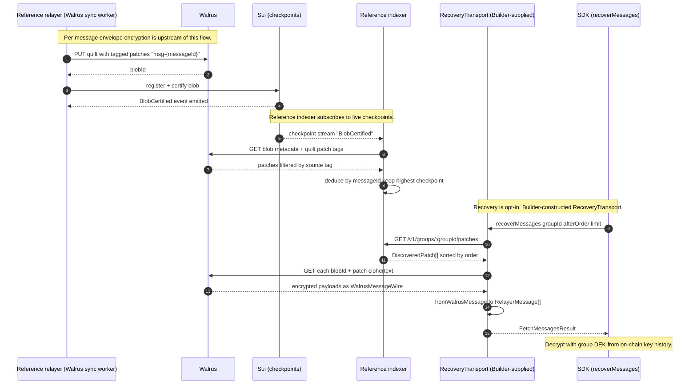
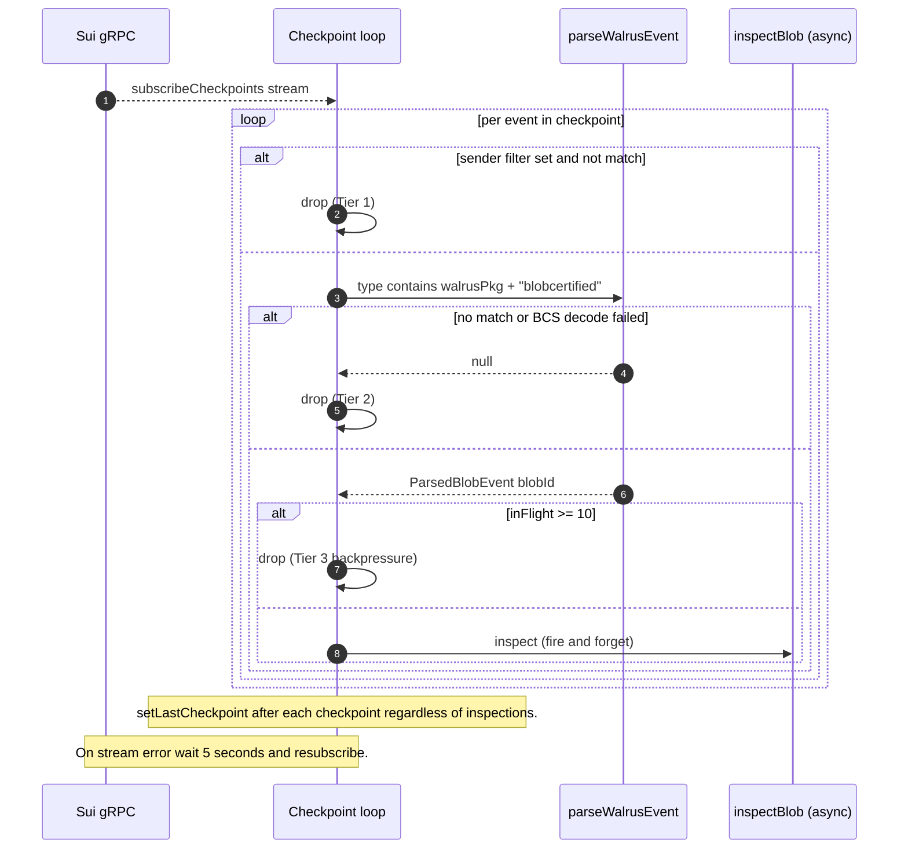
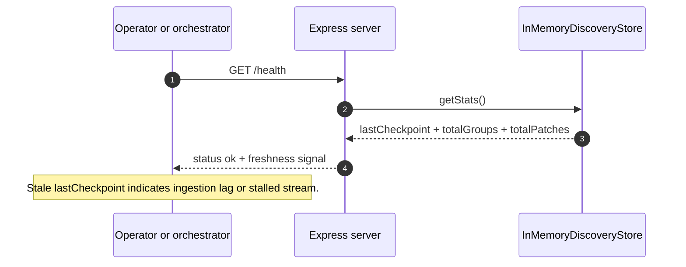

# 03 — Recovery Indexer

This file specifies the one interface the SDK binds to on the recovery
path, and documents the TypeScript reference component shipped at
[`walrus-discovery-indexer/`](../../../walrus-discovery-indexer/).

Per **ADR-5** in [`./00_overview.md`](./00_overview.md), the SDK binds
only to the `RecoveryTransport` interface. Everything else on this page
— HTTP routes, tag schemas, patch shapes, `BlobCertified` subscription
— is a handshake between the reference relayer and the reference
indexer. Any pair of Builder-supplied producer and `RecoveryTransport`
implementation may use different mechanics and still be conformant.

User-facing narrative (how archival works, how to wire up recovery, the
reference implementations' limitations) lives in
[`../ArchiveRecovery.md`](../ArchiveRecovery.md). This document does
not restate it.

---

## Part A — What the SDK enforces

### A.1 Role on the recovery path

The SDK's primary message source is a `RelayerTransport`. The recovery
path exists for two cases the relayer cannot serve:

- **Archive replay** — the Builder's relayer lacks history the client
  needs (fresh device, cleared local state, history older than the
  relayer's retention window).
- **Relayer unavailability or distrust** — the relayer is down, being
  replaced, or a consumer wants history sourced independently of any
  single operator.

`RecoveryTransport` abstracts both cases behind a single read-only
method. The SDK composes its result back into `RelayerMessage` and
decrypts using the on-chain key history (see
[`./01_components.md § 3`](./01_components.md) for the envelope
decryption call site).

### A.2 The one SDK-enforced surface: `RecoveryTransport`

[`recovery/transport.ts:6-17`](../../../ts-sdks/packages/sui-stack-messaging/src/recovery/transport.ts):

```ts
export interface RecoverMessagesParams {
  groupId: string;
  afterOrder?: number;
  beforeOrder?: number;
  limit?: number;
}

export interface RecoveryTransport {
  recoverMessages(params: RecoverMessagesParams): Promise<FetchMessagesResult>;
}
```

That is the entire canonical interface. The published SDK does **not**
include a `RecoveryTransport` implementation — only `dist/` is in the
package `files`. The Builder constructs one when wiring recovery up.

A **copy-paste example** that targets the reference indexer + Walrus
aggregator lives in the repo at
[`ts-sdks/packages/sui-stack-messaging/examples/recovery-transport/`](../../../ts-sdks/packages/sui-stack-messaging/examples/recovery-transport/)
(`walrus-recovery-transport.ts` + `types.ts` + `README.md`). It uses
`fromWalrusMessage` (see A.3) and covers: pagination against the
reference indexer's `/v1/groups/:groupId/patches`, per-patch fetching
from a Walrus aggregator, timeouts, and error propagation. Builders
copy it verbatim and adjust for their chosen backend. It is not part
of the npm artifact.

Called from the public client method
[`client.ts:545-560`](../../../ts-sdks/packages/sui-stack-messaging/src/client.ts).
If no `RecoveryTransport` is configured, `recoverMessages` throws — the
recovery path is strictly opt-in.

### A.3 Optional payload handshake — `WalrusMessageWire` + `fromWalrusMessage`

A `RecoveryTransport` that pulls bytes out of Walrus has to decode them
into `RelayerMessage`. The SDK ships one helper that a transport _may_
reuse:
[`recovery/walrus-message.ts:29-53`](../../../ts-sdks/packages/sui-stack-messaging/src/recovery/walrus-message.ts)
converts a `WalrusMessageWire` into a `RelayerMessage`.

Producers that want their output to be decodable by this helper must
serialize each message as `WalrusMessageWire`
([`types.ts:22-37`](../../../ts-sdks/packages/sui-stack-messaging/src/recovery/types.ts)):

| Field                | Type                     | Notes                                                     |
| -------------------- | ------------------------ | --------------------------------------------------------- |
| `id`                 | `string`                 | UUID assigned by the producer                             |
| `group_id`           | `string`                 | On-chain group object ID, 0x-prefixed                     |
| `order`              | `number \| null`         | Per-group monotonic order, nullable if missing            |
| `sender_wallet_addr` | `string`                 | Sender's Sui address, 0x-prefixed                         |
| `encrypted_msg`      | `number[]`               | Ciphertext as `Vec<u8>` — Rust `serde_json::to_vec` idiom |
| `nonce`              | `number[]`               | AES-GCM nonce as `Vec<u8>`                                |
| `key_version`        | `number`                 | DEK version, resolves into the on-chain key history       |
| `created_at`         | `string`                 | ISO 8601                                                  |
| `updated_at`         | `string`                 | ISO 8601                                                  |
| `sync_status`        | `string`                 | One of `SYNCED`, `UPDATED`, `DELETE_PENDING`, `DELETED`   |
| `quilt_patch_id`     | `string \| null`         | Walrus quilt patch ID                                     |
| `attachments`        | `WalrusAttachmentWire[]` | Nonces and encrypted metadata, also as `Vec<u8>`          |
| `signature`          | `string?`                | Optional — present when the producer signs archives       |
| `public_key`         | `string?`                | Optional — paired with `signature`                        |

This handshake is **not required by the interface**. A custom
`RecoveryTransport` that pulls messages from a non-Walrus backing store,
or serializes Walrus payloads in a different shape, simply does not call
`fromWalrusMessage` and returns a `FetchMessagesResult` it builds
itself. The SDK never inspects the byte format.

### A.4 What the SDK does NOT constrain

To make the boundary explicit — none of the following appear in the SDK
and none are enforced by any SDK-shipped code:

- **Transport protocol.** HTTP, gRPC, WebSocket, or in-process calls
  all satisfy the interface.
- **Presence of an indexer.** A `RecoveryTransport` may query Sui events
  and Walrus blobs directly and skip any indexing layer entirely.
- **Walrus tag schema.** The `source` / `group_id` / `sender` /
  `sync_status` / `order` tags used by the reference producer/indexer
  pair are a mutual convention, not SDK-enforced.
- **Patch identifier format.** The `msg-{messageId}` prefix is the
  reference pair's convention.
- **REST path layout.** `/v1/groups/:groupId/patches` is the reference
  indexer's route; the SDK never constructs URLs.
- **Cursor transmission.** `afterOrder` / `beforeOrder` are parameters
  on the interface method; how they travel to the backend is the
  transport's choice.

All of these live in Part B as the **reference pair's handshake**.

### A.5 Cross-references

- Consumer-side call site and `RecoveryTransport` composition:
  [`./01_components.md § 3`](./01_components.md).
- Producer-side writes (the reference relayer's Walrus sync worker):
  [`./02_relayer.md`](./02_relayer.md) Part B.6.
- User-facing recovery narrative:
  [`../ArchiveRecovery.md`](../ArchiveRecovery.md).
- Threat model for the recovery path:
  [`./04_threat_model.md`](./04_threat_model.md).

---

## Part B — Reference pair: TS indexer + reference relayer handshake

The reference `walrus-discovery-indexer/` is a single Node.js 22 process
that watches Sui checkpoints for `BlobCertified` events, reads Walrus
quilt metadata, and serves per-group patch listings over HTTP. It pairs
with the reference Rust relayer's Walrus sync worker — together they
form one valid realization of a recovery pipeline that a Builder-supplied
`RecoveryTransport` can consume.

Production deployments are expected to run their own indexer with
durability, auth, and backfill — see
[`../ArchiveRecovery.md`](../ArchiveRecovery.md) § Current Limitations
for the explicit guidance.

### B.1 Reference handshake — writes, tags, events

The reference relayer's Walrus sync worker (see
[`./02_relayer.md`](./02_relayer.md) Part B.6) performs two coordinated
writes per batch of messages:

1. **Walrus quilt with tagged patches.** Each patch carries:
   - patch `identifier`: literal `"msg-{messageId}"` prefix
     ([`blob-inspector.ts:22`](../../../walrus-discovery-indexer/src/blob-inspector.ts));
   - `source` tag: exact string `"sui-messaging-relayer"`
     ([`constants.ts:1-7`](../../../walrus-discovery-indexer/src/constants.ts));
   - `group_id`, `sender`, `sync_status`, and `order` tags.
2. **Walrus `BlobCertified` event on Sui.** Standard Walrus event
   emitted as a side effect of certifying the blob; the reference
   indexer reads it from the checkpoint stream. BCS layout at
   [`event-parser.ts:6-13`](../../../walrus-discovery-indexer/src/event-parser.ts).

The **`source` tag and identifier prefix together form the reference
discovery filter** — patches lacking either are ignored by this
indexer. A different producer/indexer pair could use different tag
names or a different identifier convention; the `RecoveryTransport`
implementation owns translating whatever is written to whatever
`RelayerMessage[]` it returns.

### B.2 Reference HTTP surface

The reference indexer exposes three Express routes
([`api.ts:1-74`](../../../walrus-discovery-indexer/src/api.ts)):

| Method | Path                          | Purpose                                                               |
| ------ | ----------------------------- | --------------------------------------------------------------------- |
| GET    | `/v1/groups/:groupId/patches` | Patches for a group with cursor pagination                            |
| GET    | `/v1/patches`                 | Cross-group summary or filtered patch list                            |
| GET    | `/health`                     | Liveness plus freshness signal (last processed checkpoint and totals) |

`GET /v1/groups/:groupId/patches` accepts optional `limit` (clamped to
`min(value, 100)`, default 50), `after_order`, and `before_order`. Body:

```json
{
  "groupId": "0xabc…",
  "count": 2,
  "hasMore": true,
  "patches": [
    {
      "identifier": "msg-9b1e…",
      "messageId": "9b1e3c40-…",
      "groupId": "0xabc…",
      "senderAddress": "0xdef…",
      "syncStatus": "SYNCED",
      "blobId": "qK3p…",
      "order": 17,
      "checkpoint": "48213901"
    },
    {
      "identifier": "msg-c4f2…",
      "messageId": "c4f2a17e-…",
      "groupId": "0xabc…",
      "senderAddress": "0x012…",
      "syncStatus": "UPDATED",
      "blobId": "qK3p…",
      "order": 18,
      "checkpoint": "48213917"
    }
  ]
}
```

`patches` is a `DiscoveredPatch[]` (shape in B.3) sorted ascending by `order`.
Cursors are exclusive. `hasMore` reflects whether at least one patch
exists beyond the window. `/health` returns `lastCheckpoint`,
`totalGroups`, and `totalPatches` — operators watch `lastCheckpoint` as
a lag signal.

### B.3 `DiscoveredPatch` — reference indexer's model

The reference indexer surfaces this shape over HTTP
([`types.ts:8-17`](../../../walrus-discovery-indexer/src/types.ts)). It
is the indexer's **internal model**, not an SDK type — a `RecoveryTransport`
that talks to this indexer parses it locally and returns `RelayerMessage[]`:

| Field           | Type             | Meaning                                                               |
| --------------- | ---------------- | --------------------------------------------------------------------- |
| `identifier`    | `string`         | Walrus quilt patch identifier — literal `"msg-{messageId}"`           |
| `messageId`     | `string`         | UUID assigned by the producer                                         |
| `groupId`       | `string`         | On-chain group object ID, 0x-prefixed                                 |
| `senderAddress` | `string`         | Sender's Sui address, 0x-prefixed                                     |
| `syncStatus`    | `string`         | One of `SYNCED`, `UPDATED`, `DELETED`, `DELETE_PENDING`               |
| `blobId`        | `string`         | Walrus base64url blob ID containing the patch                         |
| `order`         | `number \| null` | Per-group monotonic order; `null` if missing                          |
| `checkpoint`    | `string`         | Sui checkpoint sequence at which the certification event was observed |

### B.4 End-to-end recovery sequence (reference pair + SDK)

The load-bearing picture: reference relayer writes, reference indexer
ingests, a `RecoveryTransport` backed by the reference indexer reads,
SDK decrypts. Participants are explicit — swap any one of them out and
the interface still holds.



### B.5 Reference indexer — process and runtime

- Single Node.js 22 process, ESM only
  ([`Dockerfile:1,14`](../../../walrus-discovery-indexer/Dockerfile),
  [`package.json:5`](../../../walrus-discovery-indexer/package.json)).
- TypeScript, `target ES2022`, `module NodeNext`, compiled to `dist/`.
- Dev: `tsx watch src/index.ts`. Prod: `node dist/index.js`. Container
  exposes port `3001` with a `HEALTHCHECK` on `/health`.
- Bootstrap at
  [`src/index.ts:10-58`](../../../walrus-discovery-indexer/src/index.ts)
  wires config, gRPC client, Walrus client, in-memory store, Express
  server, and the checkpoint listener.

### B.6 Dependencies

| Package          | Version   | Use                                                                 |
| ---------------- | --------- | ------------------------------------------------------------------- |
| `@mysten/sui`    | `^2.13.2` | `SuiGrpcClient.subscriptionService.subscribeCheckpoints` for events |
| `@mysten/walrus` | `^1.1.0`  | `getBlobType` (auto-derive package ID); `getBlob` + `file.getTags`  |
| `express`        | `^4.21.0` | REST API                                                            |
| `dotenv`         | `^16.4.0` | Env var loading                                                     |

### B.7 Configuration

[`src/config.ts:1-31`](../../../walrus-discovery-indexer/src/config.ts):

| Env var                        | Default | Notes                                                           |
| ------------------------------ | ------- | --------------------------------------------------------------- |
| `NETWORK`                      | none    | Required. `testnet` or `mainnet`. Drives the gRPC fullnode URL. |
| `WALRUS_PUBLISHER_SUI_ADDRESS` | unset   | Optional. When set enables Tier-1 sender filter (see B.9).      |
| `PORT`                         | `3001`  | HTTP listen port.                                               |

The Walrus package ID is auto-derived at startup by calling
`walrusClient.getBlobType()`
([`src/index.ts:24-26`](../../../walrus-discovery-indexer/src/index.ts)).

### B.8 Checkpoint subscription

Live Sui checkpoints over gRPC with a field mask narrowed to events
([`checkpoint-listener.ts:28-30`](../../../walrus-discovery-indexer/src/checkpoint-listener.ts)):

```ts
grpcClient.subscriptionService.subscribeCheckpoints({
  readMask: { paths: ["sequence_number", "transactions.events"] },
});
```

No historical backfill — only events arriving after the process starts
are observed. On restart, the in-memory store begins empty and the
subscription resumes from the live tip. Operators that need durability
or backfill replace the store and add a cursor-driven backfill loop
(see B.14); the `RecoveryTransport` interface is indifferent to either.

**Subscription lifecycle.** The Sui gRPC server closes the checkpoint
subscription every ~30 seconds by design, so reconnection is the
normal-path operating mode rather than an error case. The reference
impl's 5-second-and-retry loop works for dev traffic but loses every
checkpoint delivered during the gap, because there is no cursor and no
gap-fill step. A production indexer treats reconnect as routine and
pairs it with B.14's backfill.

### B.9 Three-tier event filter

The listener applies three filters in order to each event
([`checkpoint-listener.ts:46-69`](../../../walrus-discovery-indexer/src/checkpoint-listener.ts)):

1. **Tier 1 — sender filter (optional, sync).** If
   `WALRUS_PUBLISHER_SUI_ADDRESS` is set, events from any other sender
   are dropped immediately. Useful for deployments scoped to a single
   relayer's publisher key.
2. **Tier 2 — Walrus event match (sync).** The event type must contain
   the auto-derived Walrus package ID and the literal `blobcertified`
   (case-insensitive). On match the BCS payload is decoded
   ([`event-parser.ts:22-46`](../../../walrus-discovery-indexer/src/event-parser.ts)).
3. **Tier 3 — blob inspection (async, non-blocking).** Detailed in
   B.10. Bounded concurrency: `MAX_CONCURRENT_INSPECTIONS = 10`
   ([`checkpoint-listener.ts:8`](../../../walrus-discovery-indexer/src/checkpoint-listener.ts));
   when the cap is hit, additional events are **dropped from
   inspection** for that checkpoint window rather than queued. Durability
   for dropped events is delegated to the producer (re-certify to
   re-emit).



### B.10 Async blob inspection with bounded concurrency

[`blob-inspector.ts:6-57`](../../../walrus-discovery-indexer/src/blob-inspector.ts)
fetches **quilt metadata only** — never the patch contents:

1. `walrusClient.getBlob({ blobId })` retrieves the quilt index.
2. `blob.files({ tags: [{ source: SOURCE_TAG }] })` filters at the
   Walrus client layer to patches tagged
   `source = "sui-messaging-relayer"`.
3. Per file: read the patch identifier, require the `msg-` prefix, then
   read the four metadata tags (`group_id`, `sender`, `sync_status`,
   `order`).
4. Build a `DiscoveryEvent { blobId, checkpoint, discoveredAt, patches[] }`
   and hand it to the store.

No metadata caching — every certification event triggers a fresh
`getBlob`. "Unsupported quilt version" warnings are suppressed; other
inspection failures log and return `null`. No circuit breaker.

### B.11 Discovery store

[`src/discovery-store.ts:4-107`](../../../walrus-discovery-indexer/src/discovery-store.ts)
ships the `DiscoveryStore` interface and an `InMemoryDiscoveryStore`:

- Internal layout: `Map<groupId, Map<messageId, DiscoveredPatch>>` plus
  a `lastCheckpoint: bigint`.
- `addDiscovery(event)` upserts each patch. On `messageId` conflict the
  patch with the higher Sui checkpoint wins — producers re-emit
  corrected metadata by re-certifying.
- `getByGroup(groupId, { limit, afterOrder, beforeOrder })` sorts
  ascending by `order`, applies cursor filters, and computes `hasMore`
  by requesting one extra row beyond `limit`.

**No durability.** A restart drops every observed patch. Operators
needing durability swap in a database-backed store behind the same
interface.

### B.12 API server details

[`src/api.ts:1-74`](../../../walrus-discovery-indexer/src/api.ts)
registers the three routes from B.2. Behavior notes:

- `limit` clamped to `min(parsedLimit || 50, 100)`.
- Cursor params are exclusive (`>`/`<`).
- **No authentication.** Operators add edge auth (gateway, ingress,
  mTLS) per their deployment. Endpoints leak only on-chain-visible
  metadata (`groupId`, `sender`, `blobId`, message identifiers) but
  operators may still want rate-limiting or scoping.



### B.13 Error handling and operational notes

- **gRPC stream errors and server-initiated closes:** caught by the
  outer `while` loop, logged, followed by a 5-second `setTimeout` before
  `subscribeCheckpoints` is called again
  ([`checkpoint-listener.ts:75-79`](../../../walrus-discovery-indexer/src/checkpoint-listener.ts)).
  Previously observed patches are retained in the store, but anything
  delivered during the reconnect gap is lost — the reference impl does
  no cursor tracking or gap-fill (see B.8 and B.14). Because the gRPC
  server closes the subscription every ~30s by design, this gap is hit
  routinely, not just on errors.
- **Blob inspection errors:** logged once per blob (with the noisy
  "Unsupported quilt version" suppressed); the discovery is skipped. No
  retry, no dead-letter.
- **BCS decode errors:** silent skip.
- **Backpressure:** Tier-3 cap is the only backpressure mechanism. Under
  sustained load above 10 concurrent inspections events are dropped
  from inspection.
- **Shutdown:** SIGINT and SIGTERM trigger an `AbortController.abort()`
  that unwinds the listener loop and closes the HTTP server before
  `process.exit(0)`.

### B.14 What the reference pair deliberately omits

Each omission is a swap point — none are features of the `RecoveryTransport`
interface:

- Persistent storage. Replace `InMemoryDiscoveryStore` with a DB-backed
  impl.
- Historical backfill and gap-fill on reconnect. Persist a
  `(lastCheckpointSequence, lastTransactionDigest)` cursor. On every
  (re)connect, compare the first message's checkpoint cursor to the
  persisted one and fetch each missed checkpoint by sequence number via
  `grpcClient.ledgerService.getCheckpoint({ checkpointId: { oneofKind:
'sequenceNumber', sequenceNumber: seq }, readMask })` using the same
  event read-mask as the live subscription; run each fetched checkpoint
  through the same Tier-2/Tier-3 pipeline, then update the cursor. The
  transaction-digest part of the cursor disambiguates within-checkpoint
  resume if the indexer can crash mid-checkpoint. This is gRPC-native
  and replaces the older JSON-RPC `suix_queryEvents` pattern entirely.
- Authentication and rate limiting.
- Multi-tenant isolation beyond the optional sender filter.
- Metadata caching.

For the user-facing rationale — why production deployments run their
own indexer rather than rely on the reference impl — see
[`../ArchiveRecovery.md`](../ArchiveRecovery.md).
