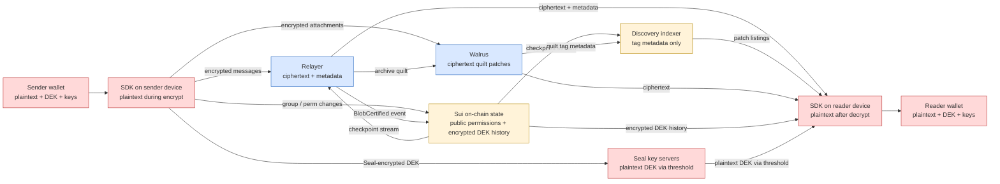

# 04 · Threat model

> Current-state STRIDE model for `sui-stack-messaging`. Narrative source-of-truth for the trust model is [`../Security.md`](../Security.md); this file systematizes it into a table with explicit attribution of each mitigation to the actor that enforces it.

- [`00_overview.md`](./00_overview.md) — system framing and ADRs.
- [`01_components.md`](./01_components.md) — Move package and SDK: objects, extension interfaces, end-to-end flows.
- [`02_relayer.md`](./02_relayer.md) — HTTP interface and reference relayer.
- [`03_recovery_indexer.md`](./03_recovery_indexer.md) — `RecoveryTransport` interface and reference recovery indexer.

---

## 1. Actors, assets, and the mitigation-owner column

Every STRIDE row below names the actor that enforces its mitigation. The same threat can be mitigated in different places for different deployments, and this column is load-bearing when a Builder forks the reference relayer or recovery indexer: **mitigations owned by the reference impls are replaceable**, and a custom implementation that does not re-implement them shifts that column's value accordingly.

| Mitigation owner      | What it means                                                                                                              |
| --------------------- | -------------------------------------------------------------------------------------------------------------------------- |
| **Protocol**          | Enforced by the Move package and SDK — cryptographic or on-chain. Cannot be removed without forking the canonical surface. |
| **Reference relayer** | Provided by the reference Rust relayer. A custom relayer that honors the wire interface may or may not re-implement this.  |
| **Reference indexer** | Provided by the reference TypeScript recovery indexer. Same caveat as the relayer.                                         |
| **Operator**          | Action lives outside code — Builders run infra, admin workflows, or auth gateways.                                         |
| **End user**          | Wallet hygiene and device security. Out of SDK scope.                                                                      |
| **Accepted**          | A by-design trade-off. Documented, not mitigated.                                                                          |

## 2. Trust-boundary diagram

**Legend.** Red nodes see plaintext, blue nodes see ciphertext, yellow nodes see metadata or public on-chain state only. The on-chain `EncryptionHistory` object holds the Seal-encrypted DEK — the ciphertext is public, the plaintext is reachable only with a valid `seal_approve_reader` dry-run.

## 3. Asset inventory

| ID  | Asset                  | Description                                                               | Lives in                                  |
| --- | ---------------------- | ------------------------------------------------------------------------- | ----------------------------------------- |
| A1  | Message plaintext      | User-authored content                                                     | Sender + reader devices only              |
| A2  | Group DEK              | AES-256 data encryption key                                               | Seal threshold; cached briefly on devices |
| A3  | Session key            | Ephemeral signer for Seal access                                          | SDK client; default TTL 10 min            |
| A4  | Attachment plaintext   | File content + filename + mime                                            | Sender + reader devices only              |
| A5  | Message ciphertext     | AES-GCM output + AAD binding                                              | Relayer, Walrus quilts, device caches     |
| A6  | Message metadata       | `sender_address`, `group_id`, `order`, timestamps, attachment storage IDs | Relayer, recovery indexer                 |
| A7  | Group permissions      | On-chain `PermissionedGroup<Messaging>` state                             | Sui                                       |
| A8  | Encryption key history | Versioned encrypted DEKs                                                  | Sui (`EncryptionHistory`)                 |
| A9  | Per-message signature  | Ed25519 / Secp256k1 / Secp256r1 over canonical content                    | Relayer, Walrus, devices                  |

## 4. STRIDE table

Each row: `(asset, threat) → mitigation → owner`. Letters in the STRIDE column are the dominant category.

| #   | Asset  | Threat                                                                                  | STRIDE | Mitigation                                                                                                                                                                                                                                                | Owner                        | Source                                                                                                             |
| --- | ------ | --------------------------------------------------------------------------------------- | ------ | --------------------------------------------------------------------------------------------------------------------------------------------------------------------------------------------------------------------------------------------------------- | ---------------------------- | ------------------------------------------------------------------------------------------------------------------ |
| 1   | A1, A5 | Eavesdropping in transit and at rest                                                    | I      | AES-256-GCM end-to-end encryption. Relayer, Walrus, and recovery indexer handle only ciphertext.                                                                                                                                                          | Protocol                     | [`../Encryption.md`](../Encryption.md), [`01 § 2`](./01_components.md)                                             |
| 2   | A1     | Message tampering in transit                                                            | T      | AES-GCM 16-byte auth tag. Modified ciphertext fails decryption.                                                                                                                                                                                           | Protocol                     | [`01 § 2`](./01_components.md)                                                                                     |
| 3   | A1, A6 | Cross-context replay — moving a ciphertext to a different group, version, or sender     | T      | AAD binds `[group_id][key_version][sender_address]`. Any field mismatch fails decryption.                                                                                                                                                                 | Protocol                     | [`01 § 2`](./01_components.md), [`../Encryption.md`](../Encryption.md)                                             |
| 4   | A1, A9 | Sender impersonation — attributing a message to a different wallet                      | S      | Per-message signature over canonical `"{group_id}:{encrypted_text}:{nonce}:{key_version}"` plus public key. Readers verify against claimed sender.                                                                                                        | Protocol                     | [`01 § 2`](./01_components.md), [`02 § A.2`](./02_relayer.md)                                                      |
| 5   | A9     | Request forgery against a relayer                                                       | S      | Outer request signature header `X-Signature` + TTL on `timestamp`. Address derived Blake2b-256(flag‖pubkey) and matched against claimed sender.                                                                                                           | Protocol                     | [`02 § A.2`](./02_relayer.md)                                                                                      |
| 6   | A2     | Unauthorized DEK access                                                                 | I, E   | Seal threshold encryption + on-chain `seal_approve_reader` checks `MessagingReader`. Decryption requires a valid dry-run.                                                                                                                                 | Protocol + Seal operators    | [`01 § 1`](./01_components.md), [`../Encryption.md`](../Encryption.md)                                             |
| 7   | A2     | Seal key server collusion reconstructing a DEK                                          | I      | Threshold trust-minimization — majority collusion across independent operators required. Builders choose their server set.                                                                                                                                | Operator                     | [`../Security.md § Trust Boundaries`](../Security.md)                                                              |
| 8   | A7     | Unauthorized permission grant or revoke                                                 | E      | On-chain capability checks. Grants require `PermissionsAdmin`; self-service operations go through `GroupLeaver` / `GroupManager` actors.                                                                                                                  | Protocol                     | [`01 § 1`](./01_components.md)                                                                                     |
| 9   | A3     | Session key compromise enabling rogue decryption                                        | E      | Short-lived session keys — default TTL 10 min; auto-refresh; no persistent credential.                                                                                                                                                                    | Protocol                     | [`01 § 2`](./01_components.md), [`../Encryption.md`](../Encryption.md)                                             |
| 10  | A1     | Removed member continues reading new messages                                           | E      | `removeMembersAndRotateKey` atomic PTB revokes `MessagingReader` and rotates DEK in one transaction. Standalone `removeMember` does not — this is an admin-discipline concern.                                                                            | Protocol + Operator          | [`01 § 3.4`](./01_components.md), [`../Security.md § No Automatic Key Rotation on Member Removal`](../Security.md) |
| 11  | A1     | Post-compromise: attacker with past DEK reads future messages                           | I      | Manual key rotation — `rotateEncryptionKey` appends a new version to `EncryptionHistory`. Window between compromise and rotation is an exposure window.                                                                                                   | Operator                     | [`../Security.md § Post-Compromise Security`](../Security.md)                                                      |
| 12  | A1     | New member reads historical messages                                                    | I      | **By-design** — `seal_approve_reader` permits any past `key_version` to a current `MessagingReader`. Builders requiring stricter forward secrecy implement a custom Seal policy with version gates.                                                       | Accepted                     | [`../Security.md § Forward Secrecy`](../Security.md), [`../Extending.md`](../Extending.md)                         |
| 13  | A2     | Nonce collision under the same DEK (XOR leak + auth break)                              | I      | Random 96-bit AES-GCM nonces. NIST SP 800-38D ceiling of 2^32 messages per key; periodic rotation recommended for high-volume groups.                                                                                                                     | Operator                     | [`../Security.md § Nonce Collision Risk`](../Security.md)                                                          |
| 14  | A5, A6 | Relayer misbehaviour — reorder, drop, or duplicate messages                             | T, D   | Per-group `order` is assigned by the handling relayer and not cryptographically anchored on Sui. Clients can implement application-level dedupe or cross-check against Walrus archival. Confidentiality and sender-authenticity remain intact regardless. | Reference relayer + Operator | [`../Security.md § Relayer as a Delivery Operator`](../Security.md), [`02 § A.4`](./02_relayer.md)                 |
| 15  | A6     | Metadata observation — who sent what when and to which group                            | I      | Accepted. A relayer must see sender + timestamp + group + attachment storage IDs to route and store messages. Builders who cannot accept this delegate to their own infrastructure.                                                                       | Accepted                     | [`../Security.md § Trust Boundaries`](../Security.md)                                                              |
| 16  | A5     | Message censorship — selective drop of a member's messages                              | D      | Not prevented. Relayer is a trusted delivery operator; Builders running their own relayer can layer auditability, rate limits, or external logging.                                                                                                       | Reference relayer + Operator | [`../Security.md § Relayer as a Delivery Operator`](../Security.md)                                                |
| 17  | A2, A7 | Stale permission cache — a revoked member accepted after revoke but before cache update | E      | Reference relayer subscribes to Sui checkpoint stream; revocations become enforced when the worker processes the checkpoint. Latency is bounded by checkpoint cadence. Fresh cache snapshot lost on restart (in-memory store).                            | Reference relayer + Operator | [`02 § B.6`](./02_relayer.md)                                                                                      |
| 18  | A6     | Recovery indexer exposes listings without authorization                                 | I      | **Not mitigated in reference impl** — the TS reference indexer serves three HTTP routes with no authentication. Operators running a public endpoint add an auth gateway or reverse proxy.                                                                 | Operator                     | [`03 § B.12`](./03_recovery_indexer.md)                                                                            |
| 19  | A6     | Data gap after indexer restart — events missed between crash and resubscribe            | D      | **Not mitigated in reference impl** — the TS reference indexer has no persistence and no backfill. Operators running production indexers swap the `DiscoveryStore` for a persistent implementation or keep hot standbys.                                  | Reference indexer + Operator | [`03 § B.11`](./03_recovery_indexer.md)                                                                            |
| 20  | A2     | Device or wallet compromise exposes all group history                                   | E      | Out of SDK scope. Wallet key storage and device security are end-user responsibility. DEK cache is in-memory only, but session keys and the wallet signing key still live with the user.                                                                  | End user                     | [`../Security.md § Recommendations for Developers`](../Security.md)                                                |

## 5. Forward secrecy and post-compromise security

The protocol does **not** offer per-message forward secrecy or automatic post-compromise security. Key rotation is a manual operator action, and by design any current `MessagingReader` can decrypt every past key version via Seal. Rows 10, 11, and 12 document this.

Builders whose threat model requires stronger properties can implement a custom `SealPolicy` that restricts `seal_approve` to a window of key versions (e.g. only the current version, for forward secrecy with respect to new members). The example consumer in [`move/packages/example_app/`](../../../move/packages/example_app/) shows a subscription-gated policy that can be adapted. The wire interface and identity bytes stay the same.

## 6. Builder-operator shifts

This section captures how the mitigation column shifts when Builders deviate from running the reference implementations as-is.

**Reference relayer replaced by a custom implementation.**

- Rows 5, 14, 16, 17 move from _Reference relayer + Operator_ to _Operator_. A custom relayer that does not implement signature verification, checkpoint-driven permission sync, or any of the integrity properties in those rows inherits responsibility for them.
- Rows 1, 2, 3, 4, 6, 8, 9, 11 are unaffected — the protocol owns them.

**Reference recovery indexer replaced or skipped.**

- Row 18 remains an operator concern either way (the reference impl is explicitly unauthenticated).
- Row 19 moves to _Operator_ when the operator runs a durable indexer. Consumers that do not wire up the recovery transport at all skip this row entirely — archive recovery is opt-in.

**Relayer consolidated into a Builder's existing backend.**

- Row 15 becomes a privacy-programme concern — metadata crosses whatever trust boundary the Builder's backend already sits behind.
- Row 14 gets easier to reason about if the backend already has ordering guarantees (e.g. serializable writes); harder if it does not.

**No indexer, archive path disabled.**

- Rows 18 and 19 are eliminated. Row 15 still applies to the relayer. Row 16 remains as-is — relayer censorship is orthogonal to the recovery path.

> **Note.** Builders seeking stronger guarantees for rows 14–16 can run their relayer inside an attested TEE (e.g. [Nautilus](https://github.com/MystenLabs/nautilus)) — not integrated in the reference impl, but a viable option for Builders with that threat model.

---

## 7. What this TDD does not cover

- **Operational risks** — monitoring, on-call, rotation cadence, key custody for admin wallets. These live in Builder runbooks, not in protocol docs.
- **External-system threat models** — Seal committee formation, Walrus durability guarantees, Sui consensus. These have their own documentation.
- **Application-layer threats** — phishing in the UI, recovery-code handling, social engineering of admins. These are Builder concerns.
- **Formal verification** — the AES-GCM, Seal, and Sui primitives are trusted as specified. No machine-checked proofs are maintained in this repository.
